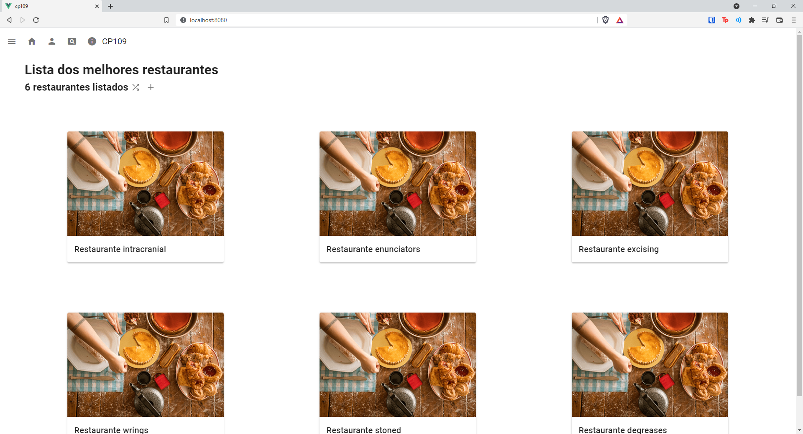

# cp109 - AF1
# Vitor Silva Bueno
190925 

## Tela do Projeto


## Instalação do Projeto
```
npm install
```

### Compilação com HotReload
```
npm run serve
```

### Compilar e gerar o min
```
npm run build
```


